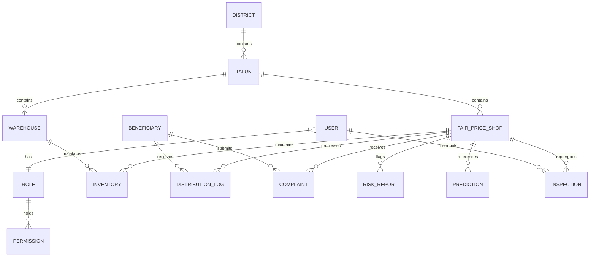
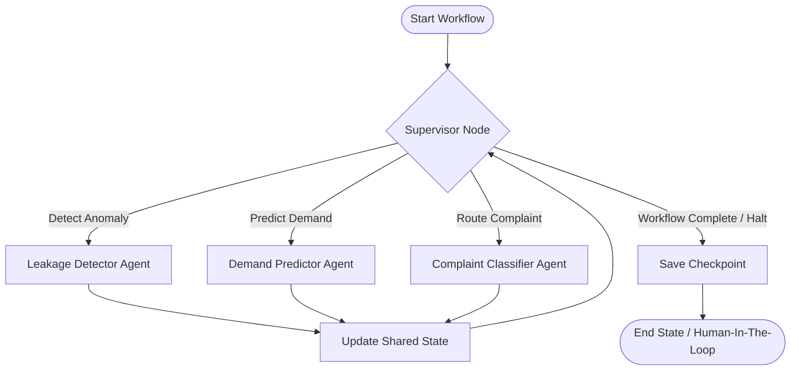

# PDS Sentinel AI – Backend Architecture and System Design Document
## Multi-Agent Intelligent Public Distribution Monitoring Platform

This document defines the production-grade, highly scalable backend and AI orchestration architecture for the PDS Sentinel AI platform. This platform monitors the Public Distribution System (PDS) in Tamil Nadu using FastAPI, LangGraph, PostgreSQL, and Redis.

---

## 1. Clean Architecture Folder Structure

The backend follows the principles of Clean Architecture. Dependencies flow inwards: database models and external interfaces depend on the core domain logic, never the other way around.

```
app/
├── api/                  # Presentation Layer: Handles incoming HTTP requests and WebSocket connections
│   ├── v1/               # Versioned API routes
│   │   ├── endpoints/    # Feature-specific router modules (auth, inventory, inspections, etc.)
│   │   └── router.py     # Aggregator of all v1 routers
│   ├── deps.py           # Dependency Injection providers (DB sessions, authentication guards, Redis pools)
│   └── middleware/       # Custom API middlewares (CORS, Rate Limiting, Correlation ID tracking)
├── core/                 # Enterprise Business Rules & System Configuration
│   ├── config.py         # Global settings loading environment variables via Pydantic Settings
│   ├── security.py       # Password hashing, JWT token generation, cryptographic helpers
│   ├── logging.py        # Structured loguru/logging configurations
│   └── exceptions.py     # Custom application/domain exception hierarchies
├── db/                   # Infrastructure Layer: Database configurations and migrations
│   ├── session.py        # SQLAlchemy async engine configuration and session makers
│   ├── base.py           # Declarative base class compiling all system models for Alembic auto-generation
│   └── migrations/       # Alembic version files and environment settings
├── models/               # Enterprise Core Entities: SQLAlchemy ORM declarations (Database Schema Definition)
│   ├── user.py           # User, Role, and Permission tables
│   ├── geography.py      # District and Taluk tables
│   ├── location.py       # Fair Price Shop and Warehouse tables
│   ├── supply_chain.py   # Inventory and DistributionLog tables
│   ├── community.py      # Beneficiary and Complaint tables
│   └── compliance.py     # RiskReport, Prediction, and Inspection tables
├── schemas/              # Data Validation Layer: Pydantic v2 schemas for request validation and response serialisation
│   ├── auth.py           # JWT payloads, login requests, token formats
│   ├── user.py           # User read, write, update representations
│   ├── inventory.py      # Stock levels, transfers, replenishments
│   ├── compliance.py     # Risk details, prediction structures, inspection reports
│   └── complaint.py      # Complaint creation, routing classifications
├── repositories/         # Interface Adapters: Database CRUD operations abstracting SQL/ORM statements
│   ├── base.py           # Generic async repository wrapper implementing base CRUD
│   ├── user.py           # Specialized queries for Users, Roles, Permissions
│   ├── location.py       # Queries for shops, godowns, and spatial mapping
│   ├── supply_chain.py   # High-throughput query methods for distribution logs and inventories
│   └── compliance.py     # Queries for audit logs, risk scores, and inspections
├── services/             # Application Business Rules: Orchestrates domain logic, validation, and database operations
│   ├── auth_service.py   # JWT management, password validation, user registration
│   ├── inventory.py      # Core inventory checks, allocation rules, replenishment approvals
│   ├── compliance.py     # Analysis scheduler, inspection assignments, risk flag evaluations
│   └── workflow_run.py   # Service managing interactions with LangGraph agents and workflows
├── agents/               # AI Layer: Multi-agent logical modules, prompt templates, and LLM utilities
│   ├── leakage_detector.py # Agent checking distribution logs vs FPS capacity anomalies
│   ├── demand_predictor.py # Agent generating seasonal demand forecasts per commodity
│   ├── classifier.py     # Citizen complaint text processor and priority categorizer
│   └── supervisor.py     # Coordinator agent parsing state and deciding optimal sub-agent calls
├── workflows/            # Graph Orchestration Layer: LangGraph graph compiling and orchestration logic
│   ├── monitoring.py     # Monitoring graph registering nodes, edges, state transitions, and checkpoints
│   └── complaint_run.py  # Complaint triage and automated routing workflow
├── state/                # Workflow State Definitions: Custom schemas for LangGraph execution context
│   └── agent_state.py    # Type declarations and reducer functions for agent memory
├── utils/                # Cross-Cutting Concerns: Pure utilities without business dependencies
│   ├── geo.py            # Geographical calculations (haversine formula, spatial lookups)
│   └── datetime_utils.py # Timezone-aware date parsing and conversions (Asia/Kolkata)
├── workers/              # Asynchronous Tasks: Celery/Redis tasks for long-running, scheduled offline operations
│   ├── celery_app.py     # Celery configuration module
│   └── tasks.py          # Background tasks (e.g., PDF generation, scheduled notifications, routine cleanup)
└── tests/                # Verification Suite: Pytest module structures matching directories
    ├── conftest.py       # DB engine mocks, client fixtures, auth token mocks
    ├── api/              # Route integration tests
    ├── services/         # Business logic mock tests
    ├── repositories/     # Repository database transaction tests
    └── workflows/        # LangGraph execution mock tests
```

### Folder Responsibilities & Dependency Rules
1. **Inward-Only Dependencies**: The `core/`, `models/`, and `state/` directories must have no dependencies on the outer directories (`api/`, `repositories/`, `services/`, or `workers/`).
2. **Separation of IO**: Database queries live strictly in `repositories/`. Controllers in `api/` must call `services/` or `workflows/` rather than querying repositories directly.
3. **Data Protection**: Pydantic schemas in `schemas/` act as data-transfer objects (DTOs) guarding the boundary of the `api/` layer, preventing raw SQLAlchemy models (`models/`) from being exposed to clients.

---

## 2. Database Architecture

The data architecture uses **PostgreSQL** as the source of truth for transactional records, geographical structures, audit logs, and AI evaluations, and **Redis** for fast cache storage, rate-limiting, and short-term session storage.

### PostgreSQL Relational Schema Design



#### 1. Table: `roles`
*   **Purpose**: Stores authorization roles mapping to users.
*   **Attributes**:
    *   `id`: `UUID` (PK, default: `gen_random_uuid()`)
    *   `name`: `VARCHAR(50)` (Unique, Non-Nullable, e.g., `"StateOfficer"`, `"TalukInspector"`, `"FPSShopkeeper"`)
    *   `description`: `VARCHAR(255)` (Nullable)
    *   `created_at`: `TIMESTAMP WITH TIME ZONE` (Non-Nullable, default: `CURRENT_TIMESTAMP`)
*   **Indexes**:
    *   `idx_roles_name` (B-tree on `name`, Unique)

#### 2. Table: `permissions`
*   **Purpose**: Stores granular permissions.
*   **Attributes**:
    *   `id`: `UUID` (PK, default: `gen_random_uuid()`)
    *   `code`: `VARCHAR(100)` (Unique, Non-Nullable, e.g., `"fps:write"`, `"inspection:create"`, `"risk:view"`)
    *   `description`: `VARCHAR(255)` (Nullable)
    *   `created_at`: `TIMESTAMP WITH TIME ZONE` (Non-Nullable, default: `CURRENT_TIMESTAMP`)
*   **Indexes**:
    *   `idx_permissions_code` (B-tree on `code`, Unique)

#### 3. Table: `role_permissions`
*   **Purpose**: Junction table mapping roles to permissions (Many-to-Many).
*   **Attributes**:
    *   `role_id`: `UUID` (FK -> `roles.id`, On Delete CASCADE, Non-Nullable)
    *   `permission_id`: `UUID` (FK -> `permissions.id`, On Delete CASCADE, Non-Nullable)
*   **Keys**:
    *   Primary Key: Composite `(role_id, permission_id)`

#### 4. Table: `users`
*   **Purpose**: System credentials, identity metadata, and role assignments.
*   **Attributes**:
    *   `id`: `UUID` (PK, default: `gen_random_uuid()`)
    *   `email`: `VARCHAR(255)` (Unique, Non-Nullable)
    *   `hashed_password`: `VARCHAR(255)` (Non-Nullable)
    *   `full_name`: `VARCHAR(150)` (Non-Nullable)
    *   `phone_number`: `VARCHAR(15)` (Unique, Nullable)
    *   `role_id`: `UUID` (FK -> `roles.id`, On Delete RESTRICT, Non-Nullable)
    *   `is_active`: `BOOLEAN` (Non-Nullable, default: `TRUE`)
    *   `created_at`: `TIMESTAMP WITH TIME ZONE` (Non-Nullable, default: `CURRENT_TIMESTAMP`)
    *   `updated_at`: `TIMESTAMP WITH TIME ZONE` (Non-Nullable, default: `CURRENT_TIMESTAMP`)
*   **Indexes**:
    *   `idx_users_email` (B-tree on `email`, Unique)
    *   `idx_users_phone` (B-tree on `phone_number`)

#### 5. Table: `districts`
*   **Purpose**: Districts of Tamil Nadu.
*   **Attributes**:
    *   `id`: `UUID` (PK, default: `gen_random_uuid()`)
    *   `name`: `VARCHAR(100)` (Unique, Non-Nullable)
    *   `code`: `VARCHAR(10)` (Unique, Non-Nullable)
    *   `created_at`: `TIMESTAMP WITH TIME ZONE` (Non-Nullable, default: `CURRENT_TIMESTAMP`)
*   **Indexes**:
    *   `idx_districts_name` (B-tree on `name`, Unique)

#### 6. Table: `taluks`
*   **Purpose**: Sub-districts within administrative districts.
*   **Attributes**:
    *   `id`: `UUID` (PK, default: `gen_random_uuid()`)
    *   `district_id`: `UUID` (FK -> `districts.id`, On Delete CASCADE, Non-Nullable)
    *   `name`: `VARCHAR(100)` (Non-Nullable)
    *   `code`: `VARCHAR(10)` (Unique, Non-Nullable)
    *   `created_at`: `TIMESTAMP WITH TIME ZONE` (Non-Nullable, default: `CURRENT_TIMESTAMP`)
*   **Indexes**:
    *   `idx_taluks_district_id` (B-tree on `district_id`)
    *   `idx_taluks_code` (B-tree on `code`, Unique)

#### 7. Table: `fair_price_shops`
*   **Purpose**: Detailed registry of ration shops.
*   **Attributes**:
    *   `id`: `UUID` (PK, default: `gen_random_uuid()`)
    *   `taluk_id`: `UUID` (FK -> `taluks.id`, On Delete RESTRICT, Non-Nullable)
    *   `code`: `VARCHAR(50)` (Unique, Non-Nullable, e.g., `"FPS-3301004"`)
    *   `shopkeeper_id`: `UUID` (FK -> `users.id`, On Delete SET NULL, Nullable)
    *   `name`: `VARCHAR(150)` (Non-Nullable)
    *   `latitude`: `DOUBLE PRECISION` (Non-Nullable)
    *   `longitude`: `DOUBLE PRECISION` (Non-Nullable)
    *   `address`: `TEXT` (Non-Nullable)
    *   `is_active`: `BOOLEAN` (Non-Nullable, default: `TRUE`)
    *   `created_at`: `TIMESTAMP WITH TIME ZONE` (Non-Nullable, default: `CURRENT_TIMESTAMP`)
*   **Indexes**:
    *   `idx_fps_code` (B-tree on `code`, Unique)
    *   `idx_fps_taluk` (B-tree on `taluk_id`)
    *   `idx_fps_coords` (B-tree on `latitude`, `longitude`)

#### 8. Table: `warehouses`
*   **Purpose**: Large godowns supplying grains/commodities.
*   **Attributes**:
    *   `id`: `UUID` (PK, default: `gen_random_uuid()`)
    *   `taluk_id`: `UUID` (FK -> `taluks.id`, On Delete RESTRICT, Non-Nullable)
    *   `name`: `VARCHAR(150)` (Non-Nullable)
    *   `code`: `VARCHAR(50)` (Unique, Non-Nullable)
    *   `latitude`: `DOUBLE PRECISION` (Non-Nullable)
    *   `longitude`: `DOUBLE PRECISION` (Non-Nullable)
    *   `capacity_mt`: `NUMERIC(12, 2)` (Non-Nullable, Capacity in Metric Tons)
    *   `created_at`: `TIMESTAMP WITH TIME ZONE` (Non-Nullable, default: `CURRENT_TIMESTAMP`)
*   **Indexes**:
    *   `idx_warehouses_code` (B-tree on `code`, Unique)
    *   `idx_warehouses_taluk` (B-tree on `taluk_id`)

#### 9. Table: `inventories`
*   **Purpose**: Tracks stock levels of key commodities (Rice, Sugar, Wheat, Kerosene).
*   **Attributes**:
    *   `id`: `UUID` (PK, default: `gen_random_uuid()`)
    *   `fps_id`: `UUID` (FK -> `fair_price_shops.id`, On Delete CASCADE, Nullable)
    *   `warehouse_id`: `UUID` (FK -> `warehouses.id`, On Delete CASCADE, Nullable)
    *   `commodity`: `VARCHAR(50)` (Non-Nullable, e.g., `"Rice"`, `"Sugar"`, `"Wheat"`, `"Kerosene"`)
    *   `quantity_kg`: `NUMERIC(12, 2)` (Non-Nullable, default: `0.00`)
    *   `allocated_kg`: `NUMERIC(12, 2)` (Non-Nullable, default: `0.00`)
    *   `last_restocked_at`: `TIMESTAMP WITH TIME ZONE` (Non-Nullable, default: `CURRENT_TIMESTAMP`)
*   **Constraints**:
    *   `check_inventory_owner`: Check that either `fps_id` OR `warehouse_id` is set, but not both.
*   **Indexes**:
    *   `idx_inventory_fps` (B-tree on `fps_id`)
    *   `idx_inventory_warehouse` (B-tree on `warehouse_id`)
    *   `idx_inventory_composite` (B-tree on `fps_id`, `warehouse_id`, `commodity`)

#### 10. Table: `beneficiaries`
*   **Purpose**: Ration cardholder metadata.
*   **Attributes**:
    *   `id`: `UUID` (PK, default: `gen_random_uuid()`)
    *   `card_number`: `VARCHAR(50)` (Unique, Non-Nullable)
    *   `card_type`: `VARCHAR(20)` (Non-Nullable, e.g., `"PHH"`, `"NPHH"`, `"AAY"`)
    *   `head_of_family`: `VARCHAR(150)` (Non-Nullable)
    *   `family_members_count`: `INTEGER` (Non-Nullable, default: `1`)
    *   `registered_fps_id`: `UUID` (FK -> `fair_price_shops.id`, On Delete RESTRICT, Non-Nullable)
    *   `is_active`: `BOOLEAN` (Non-Nullable, default: `TRUE`)
    *   `monthly_rice_quota_kg`: `NUMERIC(6, 2)` (Non-Nullable)
    *   `monthly_sugar_quota_kg`: `NUMERIC(6, 2)` (Non-Nullable)
    *   `monthly_wheat_quota_kg`: `NUMERIC(6, 2)` (Non-Nullable)
    *   `monthly_kerosene_quota_l`: `NUMERIC(6, 2)` (Non-Nullable)
    *   `created_at`: `TIMESTAMP WITH TIME ZONE` (Non-Nullable, default: `CURRENT_TIMESTAMP`)
*   **Indexes**:
    *   `idx_beneficiaries_card_num` (B-tree on `card_number`, Unique)
    *   `idx_beneficiaries_fps` (B-tree on `registered_fps_id`)

#### 11. Table: `distribution_logs`
*   **Purpose**: Transaction log of all disbursements to cardholders. Highly queried.
*   **Attributes**:
    *   `id`: `UUID` (PK, default: `gen_random_uuid()`)
    *   `fps_id`: `UUID` (FK -> `fair_price_shops.id`, On Delete RESTRICT, Non-Nullable)
    *   `beneficiary_id`: `UUID` (FK -> `beneficiaries.id`, On Delete RESTRICT, Non-Nullable)
    *   `commodity`: `VARCHAR(50)` (Non-Nullable)
    *   `quantity_disbursed_kg`: `NUMERIC(8, 2)` (Non-Nullable)
    *   `transaction_timestamp`: `TIMESTAMP WITH TIME ZONE` (Non-Nullable, default: `CURRENT_TIMESTAMP`)
    *   `authentication_mode`: `VARCHAR(30)` (Non-Nullable, e.g., `"Biometric"`, `"AadhaarOTP"`, `"OfflineManual"`)
    *   `status`: `VARCHAR(20)` (Non-Nullable, default: `"Success"`, e.g., `"Failed"`, `"Reversed"`)
*   **Indexes**:
    *   `idx_dist_logs_fps_date` (Composite B-tree on `fps_id`, `transaction_timestamp` DESC)
    *   `idx_dist_logs_beneficiary` (B-tree on `beneficiary_id`)
    *   `idx_dist_logs_timestamp` (B-tree on `transaction_timestamp` DESC)

#### 12. Table: `complaints`
*   **Purpose**: Logs citizen grievances filed directly or generated programmatically.
*   **Attributes**:
    *   `id`: `UUID` (PK, default: `gen_random_uuid()`)
    *   `beneficiary_id`: `UUID` (FK -> `beneficiaries.id`, On Delete CASCADE, Non-Nullable)
    *   `fps_id`: `UUID` (FK -> `fair_price_shops.id`, On Delete SET NULL, Nullable)
    *   `subject`: `VARCHAR(150)` (Non-Nullable)
    *   `description`: `TEXT` (Non-Nullable)
    *   `status`: `VARCHAR(30)` (Non-Nullable, default: `"Open"`, e.g., `"Investigating"`, `"Resolved"`, `"Rejected"`)
    *   `category`: `VARCHAR(50)` (Nullable, evaluated by AI Agent, e.g., `"StockDiversion"`, `"Underweighment"`, `"ShopClosed"`)
    *   `urgency`: `VARCHAR(20)` (Nullable, evaluated by AI, e.g., `"Low"`, `"Medium"`, `"High"`, `"Critical"`)
    *   `assigned_to`: `UUID` (FK -> `users.id`, On Delete SET NULL, Nullable)
    *   `created_at`: `TIMESTAMP WITH TIME ZONE` (Non-Nullable, default: `CURRENT_TIMESTAMP`)
    *   `updated_at`: `TIMESTAMP WITH TIME ZONE` (Non-Nullable, default: `CURRENT_TIMESTAMP`)
*   **Indexes**:
    *   `idx_complaints_fps` (B-tree on `fps_id`)
    *   `idx_complaints_status` (B-tree on `status`)
    *   `idx_complaints_urgency` (B-tree on `urgency`)

#### 13. Table: `risk_reports`
*   **Purpose**: Records AI agent evaluations of leakages and diversions.
*   **Attributes**:
    *   `id`: `UUID` (PK, default: `gen_random_uuid()`)
    *   `fps_id`: `UUID` (FK -> `fair_price_shops.id`, On Delete CASCADE, Non-Nullable)
    *   `risk_score`: `NUMERIC(5, 2)` (Non-Nullable, range `0.00` to `100.00`)
    *   `factors`: `JSONB` (Non-Nullable, dynamic list of reasons identified by LLM/heuristics)
    *   `status`: `VARCHAR(20)` (Non-Nullable, default: `"PendingReview"`, e.g., `"Investigating"`, `"Confirmed"`, `"FalsePositive"`)
    *   `detected_at`: `TIMESTAMP WITH TIME ZONE` (Non-Nullable, default: `CURRENT_TIMESTAMP`)
*   **Indexes**:
    *   `idx_risk_reports_fps` (B-tree on `fps_id`)
    *   `idx_risk_reports_score` (B-tree on `risk_score` DESC)
    *   `idx_risk_reports_status` (B-tree on `status`)
    *   `idx_risk_reports_factors` (GIN index on `factors` for structural scanning)

#### 14. Table: `predictions`
*   **Purpose**: Forecast logs for demand and allocations.
*   **Attributes**:
    *   `id`: `UUID` (PK, default: `gen_random_uuid()`)
    *   `fps_id`: `UUID` (FK -> `fair_price_shops.id`, On Delete CASCADE, Non-Nullable)
    *   `commodity`: `VARCHAR(50)` (Non-Nullable)
    *   `predicted_demand_kg`: `NUMERIC(12, 2)` (Non-Nullable)
    *   `historical_avg_kg`: `NUMERIC(12, 2)` (Non-Nullable)
    *   `target_month`: `DATE` (Non-Nullable, starting day of month forecast is for)
    *   `metadata`: `JSONB` (Nullable, details on variables used like holiday multipliers)
    *   `generated_at`: `TIMESTAMP WITH TIME ZONE` (Non-Nullable, default: `CURRENT_TIMESTAMP`)
*   **Indexes**:
    *   `idx_predictions_fps` (B-tree on `fps_id`)
    *   `idx_predictions_target` (B-tree on `target_month`)

#### 15. Table: `inspections`
*   **Purpose**: Logs physical audits executed by Taluk Inspectors/State Officers.
*   **Attributes**:
    *   `id`: `UUID` (PK, default: `gen_random_uuid()`)
    *   `fps_id`: `UUID` (FK -> `fair_price_shops.id`, On Delete RESTRICT, Non-Nullable)
    *   `inspector_id`: `UUID` (FK -> `users.id`, On Delete RESTRICT, Non-Nullable)
    *   `risk_report_id`: `UUID` (FK -> `risk_reports.id`, On Delete SET NULL, Nullable)
    *   `inspection_date`: `TIMESTAMP WITH TIME ZONE` (Non-Nullable, default: `CURRENT_TIMESTAMP`)
    *   `stock_variance_rice_kg`: `NUMERIC(8, 2)` (Non-Nullable, physical minus system stock)
    *   `stock_variance_sugar_kg`: `NUMERIC(8, 2)` (Non-Nullable)
    *   `stock_variance_wheat_kg`: `NUMERIC(8, 2)` (Non-Nullable)
    *   `stock_variance_kerosene_l`: `NUMERIC(8, 2)` (Non-Nullable)
    *   `finding_status`: `VARCHAR(30)` (Non-Nullable, e.g., `"Satisfactory"`, `"MinorDiscrepancy"`, `"SevereDiversion"`)
    *   `action_taken`: `TEXT` (Nullable)
    *   `fine_assessed_inr`: `NUMERIC(10, 2)` (Non-Nullable, default: `0.00`)
    *   `notes`: `TEXT` (Nullable)
*   **Indexes**:
    *   `idx_inspections_fps` (B-tree on `fps_id`)
    *   `idx_inspections_inspector` (B-tree on `inspector_id`)
    *   `idx_inspections_report` (B-tree on `risk_report_id`)

---

## 3. FastAPI System Architecture

The API framework uses async operations, structured request pipelines, and clean boundaries between layers.

### 1. Presentation Layer (Routers)
Routers parse parameters and JSON requests. They delegate validation to Pydantic and logic processing to the Service layer.

*   **Version Pinning**: All active endpoints are prefixed with `/api/v1`.
*   **Mounting Configuration** (defined in `app/api/v1/router.py`):
    ```python
    from fastapi import APIRouter
    from app.api.v1.endpoints import auth, fps, inventory, inspections, complaints, workflows

    api_router = APIRouter()
    api_router.include_router(auth.router, prefix="/auth", tags=["Authentication"])
    api_router.include_router(fps.router, prefix="/fps", tags=["Fair Price Shops"])
    api_router.include_router(inventory.router, prefix="/inventory", tags=["Inventory"])
    api_router.include_router(inspections.router, prefix="/inspections", tags=["Inspections"])
    api_router.include_router(complaints.router, prefix="/complaints", tags=["Complaints"])
    api_router.include_router(workflows.router, prefix="/workflows", tags=["Agent Workflows"])
    ```

### 2. Service Layer Pattern
Services encapsulate all core domain transactions.
*   **Pure Logic Isolation**: Services receive structured schemas from routers and interact with repositories. They never process raw database queries or handle HTTP specifics (like redirecting or changing cookie values directly).
*   **Transactional Boundaries**: If a service method modifies multiple repositories (e.g., updating Inventory, adding a DistributionLog, and triggering a RiskReport flag), it manages those operations within a single database transactional context.

### 3. Repository Layer Pattern
The repository layer encapsulates all interactions with the database, exposing clean async interfaces using SQLAlchemy 2.0.

*   **Generic Base Interface**:
    ```python
    from typing import Generic, TypeVar, Type, List, Optional
    from uuid import UUID
    from sqlalchemy.ext.asyncio import AsyncSession
    from sqlalchemy import select

    ModelType = TypeVar("ModelType")

    class BaseRepository(Generic[ModelType]):
        def __init__(self, model: Type[ModelType], db_session: AsyncSession):
            self.model = model
            self.db: AsyncSession = db_session

        async def get(self, id: UUID) -> Optional[ModelType]:
            result = await self.db.execute(select(self.model).filter(self.model.id == id))
            return result.scalars().first()

        async def list(self, skip: int = 0, limit: int = 100) -> List[ModelType]:
            result = await self.db.execute(select(self.model).offset(skip).limit(limit))
            return result.scalars().all()

        async def create(self, obj_in: dict) -> ModelType:
            db_obj = self.model(**obj_in)
            self.db.add(db_obj)
            await self.db.flush()
            return db_obj
    ```

### 4. Dependency Injection (DI)
FastAPI's dependency injection container manages infrastructure clients, db connections, context retrieval, and permission checks.

*   **DB Session Provider**: `Depends(get_async_db_session)` injects scoped, async SQL sessions which are disposed of post-request.
*   **Security Context Provider**: `Depends(get_current_active_user)` decodes the bearer JWT from headers, checks activation flags, and injects the User entity.
*   **Authorization Guard**: `Depends(RequirePermission("inspection:create"))` is a callable class checking the user's role capability mapping before letting requests resolve.

### 5. Validation Pattern
Validation relies strictly on **Pydantic v2** models to parse input fields before execution.
*   **Input Models (`*Create`, `*Update`)**: Prevent SQL Injection vectors through strong types. Field validations verify range limits, pattern matches (e.g., phone numbers, card numbers), and date offsets.
*   **Output Models (`*Response`)**: Act as secure serialization profiles. Any internal field (like `hashed_password` or internal database system tags) is excluded from the validation class to prevent accidental data leaks.

### 6. Exception Handling Pipeline
Custom business errors are handled through a global handler setup.

*   **Domain Exception Hierarchy**:
    ```
    AppException (Base Exception)
    ├── EntityNotFoundError (Raised when resource queries fail)
    ├── AuthenticationFailedError (Raised for bad credentials, expired tokens)
    ├── PermissionDeniedError (Raised for RBAC authorization failures)
    └── BusinessRuleValidationError (Raised for logic rules violations, e.g., quota overruns)
    ```
*   **Global Catch Middleware**: Exception handlers catch exceptions at the application framework level and format standard JSON error schemas to clients:
    ```json
    {
      "detail": {
        "error_code": "RESOURCE_NOT_FOUND",
        "message": "Fair Price Shop with code FPS-3301004 not found.",
        "timestamp": "2026-07-27T15:32:14Z"
      }
    }
    ```

### 7. Logging & Telemetry
System tracing processes use standard structural log schemas.
*   **Correlation ID**: A middleware injects a unique `X-Correlation-ID` header into every request. This ID is attached to all subsequent database actions, workflow node executions, and worker threads.
*   **Logging Output**: Production output logs use structured JSON formatting to simplify ingestion by log aggregators (e.g., Elasticsearch, Grafana Loki).

---

## 4. LangGraph Multi-Agent Architecture

The multi-agent orchestration checks for anomalies, predicts demand, and processes complaints. It coordinates analysis and routing using a supervised flow.



### 1. Shared State Definition
The orchestrator relies on the `AgentState` configuration to propagate facts across steps.
```python
from typing import TypedDict, List, Dict, Any, Annotated
from langchain_core.messages import BaseMessage
from langgraph.graph.message import add_messages

class AgentState(TypedDict):
    # History of interactions in the thread
    messages: Annotated[List[BaseMessage], add_messages]
    
    # Context attributes
    fps_code: str
    target_month: str
    taluk_id: str
    
    # Extracted data state
    distribution_logs_snapshot: List[Dict[str, Any]]
    stock_levels: Dict[str, Any]
    
    # Processed analysis outputs
    risk_score: float
    risk_factors: List[str]
    demand_predictions: Dict[str, float]
    complaint_category: str
    complaint_urgency: str
    
    # Orchestration control variables
    next_node: str
    run_inspection_alert: bool
```

### 2. Specialized Nodes (Agents)
1.  **Supervisor / Coordinator Agent**: Inspects user instructions and parameters inside the `AgentState`, determines which sub-agent is required, and writes routing state keys.
2.  **Leakage Detector Agent**: Interacts with SQLAlchemy DB context models to read the target FPS's transaction logs and physical limits. It runs statistical checks (e.g., matching transactions against local population registers) and calculates anomaly markers.
3.  **Demand Predictor Agent**: Queries historical consumption logs, aggregates monthly distributions, and overlays seasonal models (e.g., major holidays like Pongal or Diwali) to predict restocking schedules.
4.  **Complaint Classifier Agent**: Processes unstructured text descriptions of citizen complaints, categorizes them using a zero-shot classification model, and assigns priority levels.

### 3. Edges & Conditional Routing
The Supervisor Node acts as the routing router. Conditional routing edges read `next_node` in the state to dispatch context to `LeakageDetector`, `DemandPredictor`, `ComplaintClassifier`, or to exit the graph.

### 4. Checkpoint Strategy
LangGraph uses database transactions to handle persistence.
*   **Engine**: Async Postgres/Redis checkpointers store state checkpoints (`MemorySaver` equivalent) for every change to the execution graph.
*   **State Recovery**: Long-running flows can pause when they need external verification (Human-In-The-Loop, such as a state officer approving an allocation modification), then resume using their matching `thread_id` and checkpoint metadata.

### 5. Retry Strategy
To protect nodes calling external LLM providers or distributed cache layers:
*   **Tenacity Configuration**: API nodes are wrapped in retry protocols with exponential backoff (`wait_exponential(multiplier=1, min=2, max=10)`) to handle temporary API rate limits or network issues.

### 6. Memory Design
*   **Short-Term Memory**: Shared inside the graph run using the `messages` array, keeping track of conversation history for the current analysis thread.
*   **Long-Term Memory**: Handled by services fetching historical profiles of the target Fair Price Shop (e.g., previous risk scores and inspection reports) and adding them to the state prior to execution.

---

## 5. API Specification

All endpoints are fully authenticated and require appropriate RBAC permissions.

| Method | URL | Purpose | Request Body | Response Body | Auth Level | HTTP Status Codes |
| :--- | :--- | :--- | :--- | :--- | :--- | :--- |
| **POST** | `/api/v1/auth/login` | Authenticate user and issue access and refresh tokens. | `{ "email": "str", "password": "str" }` | `{ "access_token": "str", "token_type": "bearer" }` | Public | `200 OK`, `400 Bad Request`, `401 Unauthorized` |
| **POST** | `/api/v1/auth/refresh` | Rotate expired access tokens using a refresh token. | None (reads cookie) | `{ "access_token": "str", "token_type": "bearer" }` | Public | `200 OK`, `401 Unauthorized` |
| **POST** | `/api/v1/auth/logout` | Revoke active token sequences and clear authentication cookies. | None | `{ "message": "Logged out successfully" }` | Authenticated | `200 OK`, `401 Unauthorized` |
| **GET** | `/api/v1/users/me` | Fetch active user credentials and role structures. | None | `{ "id": "uuid", "email": "str", "role": "str", "permissions": ["str"] }` | Authenticated | `200 OK`, `401 Unauthorized` |
| **GET** | `/api/v1/fps` | Query list of Fair Price Shops with filters. | None (query params: `taluk_id`, `is_active`) | `[{ "id": "uuid", "code": "str", "name": "str", "latitude": 0.0, "longitude": 0.0 }]` | Authenticated | `200 OK`, `401 Unauthorized`, `403 Forbidden` |
| **GET** | `/api/v1/fps/{fps_id}/inventory` | Query stocks and capacity allocations for an FPS. | None | `[{ "commodity": "str", "quantity_kg": 0.0, "allocated_kg": 0.0 }]` | Authenticated | `200 OK`, `401 Unauthorized`, `403 Forbidden`, `404 Not Found` |
| **POST** | `/api/v1/fps/{fps_id}/inspections` | Record manual physical audit findings. | `{ "risk_report_id": "uuid", "stock_variance_rice_kg": 0.0, "stock_variance_sugar_kg": 0.0, "stock_variance_wheat_kg": 0.0, "stock_variance_kerosene_l": 0.0, "finding_status": "str", "action_taken": "str", "fine_assessed_inr": 0.0, "notes": "str" }` | `{ "id": "uuid", "fps_id": "uuid", "inspector_id": "uuid", "inspection_date": "datetime" }` | `inspection:create` | `201 Created`, `400 Bad Request`, `401 Unauthorized`, `403 Forbidden`, `404 Not Found` |
| **POST** | `/api/v1/complaints` | File a new citizen grievance. | `{ "beneficiary_id": "uuid", "fps_id": "uuid", "subject": "str", "description": "str" }` | `{ "id": "uuid", "status": "str", "category": "str", "urgency": "str" }` | `complaint:create` | `201 Created`, `400 Bad Request`, `401 Unauthorized` |
| **PATCH** | `/api/v1/complaints/{complaint_id}/status` | Update grievance status (resolve, escalate). | `{ "status": "str", "action_taken": "str" }` | `{ "id": "uuid", "status": "str", "updated_at": "datetime" }` | `complaint:resolve` | `200 OK`, `400 Bad Request`, `401 Unauthorized`, `403 Forbidden`, `404 Not Found` |
| **GET** | `/api/v1/risks` | Retrieve list of shops flagged with anomaly risks. | None (query params: `min_score`, `status`) | `[{ "id": "uuid", "fps_id": "uuid", "risk_score": 0.0, "factors": {}, "status": "str" }]` | `risk:view` | `200 OK`, `401 Unauthorized`, `403 Forbidden` |
| **POST** | `/api/v1/workflows/run` | Trigger an offline LangGraph evaluation loop. | `{ "workflow_type": "str", "params": {} }` | `{ "task_id": "str", "status": "Pending" }` | `workflow:trigger` | `202 Accepted`, `400 Bad Request`, `401 Unauthorized`, `403 Forbidden` |

---

## 6. Authentication and Authorization Design

### 1. Dual-Token JWT Pipeline
The security pipeline uses two token classes:
*   **Access Token**: Short-lived (15 minutes), passed as a `Bearer` token in the HTTP `Authorization` header. It contains the user identity ID and active scopes.
*   **Refresh Token**: Long-lived (7 days), stored in a secure, `HttpOnly`, `SameSite=Strict`, `Secure` cookie. It is used to request new access tokens.
*   **Revocation (Blacklisting)**: On logout or session invalidation, token hashes are written to Redis with a TTL matching the token's expiration. The authentication middleware rejects any incoming token found in this blacklist.

### 2. RBAC Permission Mapping Matrix

| Permission Code | SuperAdmin | StateOfficer | DistrictOfficer | TalukInspector | FPSShopkeeper | Beneficiary |
| :--- | :---: | :---: | :---: | :---: | :---: | :---: |
| `users:manage` | **X** | | | | | |
| `fps:read` | **X** | **X** | **X** | **X** | **X** | **X** |
| `fps:write` | **X** | **X** | | | | |
| `inventory:read` | **X** | **X** | **X** | **X** | **X** | |
| `inventory:write` | **X** | **X** | **X** | | **X** | |
| `inspection:create`| **X** | **X** | **X** | **X** | | |
| `complaint:create` | **X** | | | | | **X** |
| `complaint:resolve`| **X** | **X** | **X** | **X** | | |
| `risk:view` | **X** | **X** | **X** | **X** | | |
| `workflow:trigger` | **X** | **X** | | | | |

---

## 7. Coding Standards and Guidelines

### 1. Style & Linting Rules
*   **PEP8 Adherence**: Code formatting is enforced using Black (line length of 88 characters). Imports are sorted using `isort` configurations.
*   **Type Hinting**: All Python signatures must use strict type hints, validated using static analyzers (`mypy --strict`). Return values must use explicit types (e.g., `None` or `Awaitable[Dict[str, Any]]`).

### 2. SOLID Implementation Guidelines
*   **Single Responsibility (SRP)**: Routers only parse requests, services process domain logic, and repositories query the database.
*   **Open/Closed (OCP)**: Logic modifications use inheritance or dependency interfaces rather than editing existing core classes.
*   **Liskov Substitution (LSP)**: Custom repository classes subclassing `BaseRepository` must maintain compatible API interfaces.
*   **Interface Segregation (ISP)**: Custom clients (e.g., Redis caching vs. Postgres operations) expose distinct interfaces to avoid unused dependencies.
*   **Dependency Inversion (DIP)**: High-level services depend on abstract database repository objects injected at initialization, never on concrete class instances directly.

#### Structural Example: Dependency Inversion & Repository Injection
```python
# app/repositories/fps.py
class FPSRepository(BaseRepository[FairPriceShop]):
    async def get_by_code(self, code: str) -> Optional[FairPriceShop]:
        result = await self.db.execute(
            select(FairPriceShop).filter(FairPriceShop.code == code)
        )
        return result.scalars().first()

# app/services/fps_service.py
class FPSService:
    def __init__(self, fps_repo: FPSRepository):
        self.fps_repo = fps_repo  # Injected abstraction

    async def get_shop_details(self, code: str) -> FairPriceShop:
        shop = await self.fps_repo.get_by_code(code)
        if not shop:
            raise EntityNotFoundError(f"Shop {code} not found")
        return shop

# app/api/deps.py
async def get_fps_repository(
    db: AsyncSession = Depends(get_async_db_session)
) -> FPSRepository:
    return FPSRepository(FairPriceShop, db)

# app/api/v1/endpoints/fps.py
@router.get("/{code}", response_model=FPSResponse)
async def read_fps(
    code: str,
    fps_repo: FPSRepository = Depends(get_fps_repository)
):
    service = FPSService(fps_repo)
    return await service.get_shop_details(code)
```

---

## 8. Summary of Walkthrough & Architectural Guidelines

This design document provides all the structures needed to implement the backend system. The following guidelines should be used during implementation:
1.  **Async All The Way**: Use asynchronous patterns for all network operations, database queries (SQLAlchemy `AsyncSession`), and file access.
2.  **UTC Handling**: All database timestamps must use timezone-aware formats, normalized to UTC on storage and converted to Indian Standard Time (IST) on client rendering.
3.  **Strict Security**: CORS policies must lock down origins to verified domains, and cookie storage policies must enforce `SameSite=Strict`.
